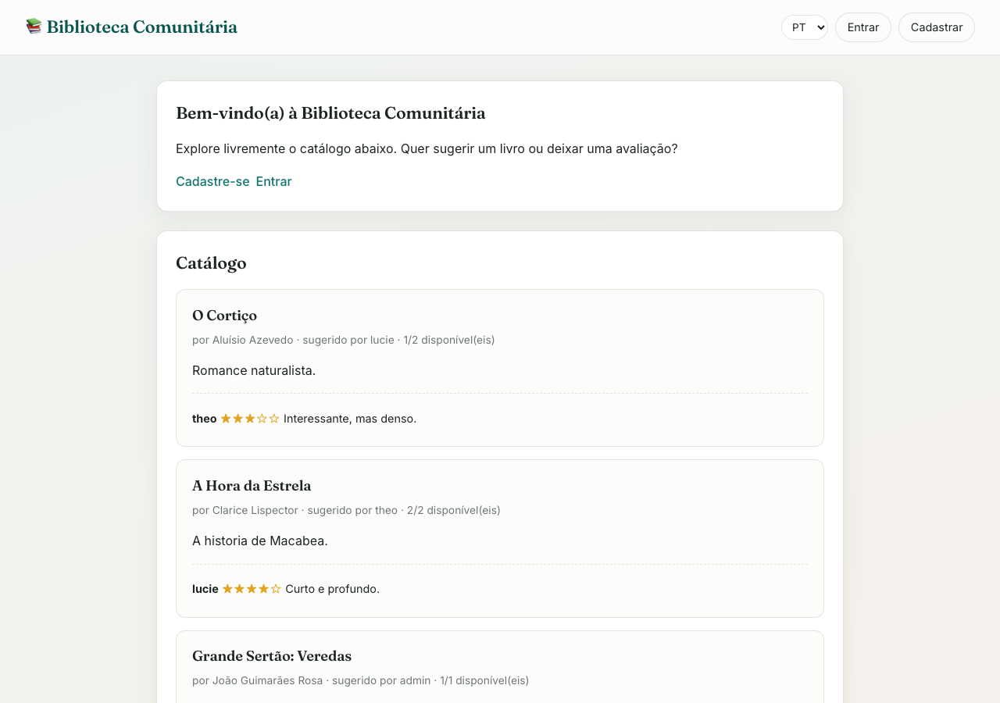
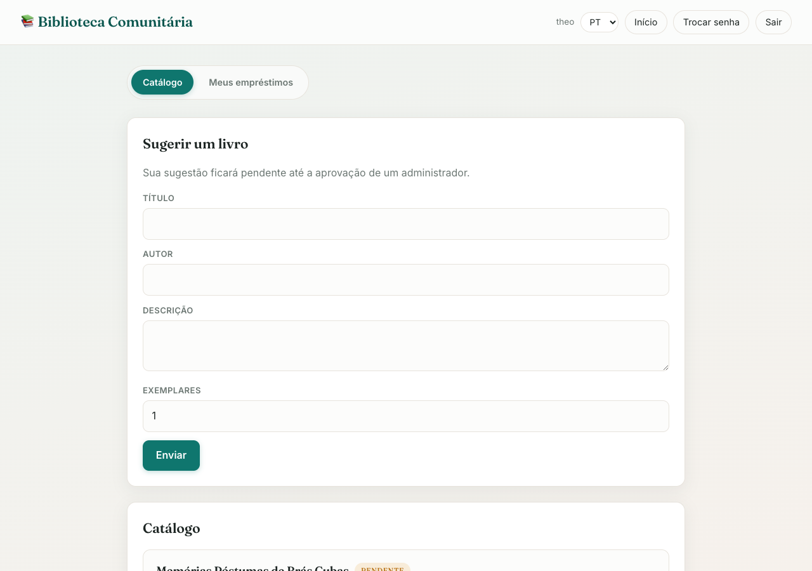
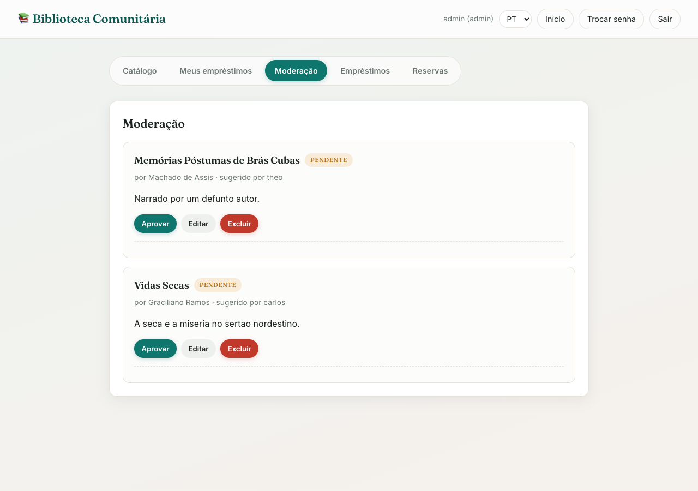
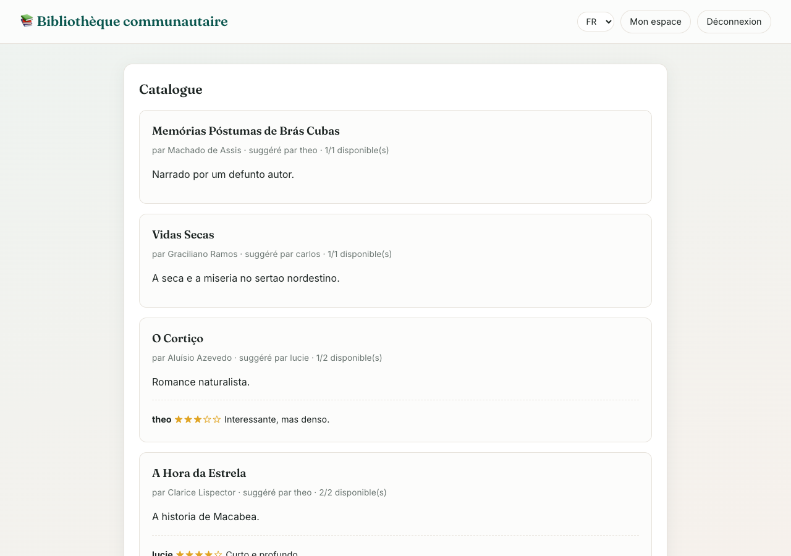

# 📚 Biblioteca Comunitária — Frontend (INF1407)

Frontend do **2º Trabalho de Programação para Web**, desenvolvido apenas com
**HTML, CSS e TypeScript** (sem frameworks). Consome a API REST do backend.

🔗 **Site online:** https://inf-1407-trab2-frontend-ow7n.vercel.app/
🔗 **Backend (API):** https://inf1407-biblioteca-api.onrender.com
🔗 **Repositório do backend:** https://github.com/lemairetheo/INF1407_Trab2_Backend

## 👥 Integrantes

* Théo Lemaire
* Lucie Brunelle

---

## 🎯 Escopo do projeto

Uma **biblioteca comunitária** onde os usuários compartilham e avaliam livros,
com um sistema de empréstimos e reservas. Existem dois perfis:

* **Administrador:** cadastra livros (publicados diretamente), aprova as
  sugestões dos usuários, remove avaliações e tem uma visão global de todos os
  empréstimos e reservas.
* **Usuário comum:** sugere livros (ficam pendentes até a aprovação), avalia,
  empresta e reserva livros, e vê apenas o catálogo aprovado + suas sugestões.

**Visitantes** (sem login) podem consultar livremente o catálogo; para sugerir
ou avaliar, precisam se cadastrar.

### Funcionalidades

* Página pública para visitantes (catálogo somente leitura).
* Login, cadastro e logout.
* Gerência de senha: troca de senha e "esqueci minha senha" (link por email).
* CRUD de livros consumindo a API.
* Avaliações (estrelas + comentário).
* Empréstimos, devoluções e reservas (fila de espera).
* Painel com **abas** e área de moderação para o administrador.
* Interface **multilíngue: Português, Francês e Inglês**.

---

## 🖥️ Capturas de tela

### Página pública (visitante)

*A página inicial sem login: catálogo de livros aprovados com avaliações e o
convite para se cadastrar.*

### Painel do usuário

*Logado como usuário comum: abas Catálogo / Meus empréstimos, formulário de
sugestão de livro e catálogo.*

### Painel do administrador (moderação)

*Logado como administrador: abas extras (Moderação, Empréstimos, Reservas) e
aprovação de livros pendentes.*

### Interface multilíngue (Francês)

*A mesma interface após trocar o idioma para Francês pelo seletor PT/FR/EN.*

---

## ⚙️ Tecnologias

* HTML5 + CSS3
* **TypeScript** (todo o JavaScript é escrito em TypeScript)
* [Vite](https://vitejs.dev/) como bundler / servidor de desenvolvimento

## 📁 Estrutura

```
.
├── index.html              # página pública (visitante)
├── dashboard.html          # painel do usuário/admin (com abas)
├── login.html / register.html
├── change-password.html / forgot-password.html / reset-password.html
└── src/
    ├── api.ts              # camada de acesso à API + JWT
    ├── i18n.ts             # internacionalização (PT/FR/EN)
    ├── ui.ts               # utilitários de interface
    ├── style.css           # estilos
    ├── home.ts             # lógica da página pública
    ├── main.ts             # lógica do painel
    └── login.ts / register.ts / change-password.ts / ...
```

## 🚀 Instalação local

Pré-requisito: ter o **backend rodando** (local ou usar o online em
`https://inf1407-biblioteca-api.onrender.com/api`).

```bash
# 1. Clonar
git clone https://github.com/lemairetheo/INF1407_Trab2_Frontend.git
cd INF1407_Trab2_Frontend

# 2. Dependências
npm install

# 3. Configurar a URL da API
cp .env.example .env
# edite VITE_API_URL (ex.: http://127.0.0.1:8000/api para o backend local)

# 4. Servidor de desenvolvimento
npm run dev                 # http://localhost:5173

# Build de produção:
npm run build               # saída em dist/
```

## 📖 Manual do usuário

1. **Visitante:** acesse o site e navegue pelo catálogo. Para participar,
   clique em **Cadastre-se**.
2. **Cadastro/Login:** crie uma conta ou entre. Após o login você vai para o
   painel.
3. **Catálogo:** veja os livros, **avalie** (nota + comentário), **Empreste**
   (se houver exemplar) ou **Reserve** (se estiver tudo emprestado).
4. **Sugerir um livro:** preencha o formulário — usuários comuns geram uma
   sugestão pendente; admins publicam direto.
5. **Meus empréstimos:** acompanhe e **devolva** seus livros, veja suas reservas.
6. **Administrador:** abas extras **Moderação** (aprovar livros), **Empréstimos**
   e **Reservas** (visão global).
7. **Trocar senha** pelo menu superior; **esqueci minha senha** na tela de login.
8. **Idioma:** troque entre PT / FR / EN no seletor no topo.

### Contas de teste

| Usuário | Senha | Perfil |
|---------|-------|--------|
| `admin` | (definida no deploy) | Administrador |
| `theo`  | `Senha12345` | Usuário comum |
| `lucie` | `Senha12345` | Usuário comum |
| `carlos`| `Senha12345` | Usuário comum |

---

## ✅ Relato — o que funciona / o que não funciona

**Funciona (testado):**

* Cadastro, login, logout e troca de conta.
* Troca de senha e fluxo "esqueci minha senha" (link enviado por email/Mailtrap).
* CRUD de livros e fluxo de aprovação (pendente → aprovado pelo admin).
* Avaliações (criar e remover).
* Empréstimos, devoluções e reservas.
* Visões diferentes por perfil (visitante / usuário / admin).
* Troca de idioma PT/FR/EN em todas as páginas.

**Limitações conhecidas:**

* O backend está hospedado no plano gratuito do Render, que **"dorme" após 15
  minutos** de inatividade. O primeiro acesso pode demorar ~30–50 s para
  "acordar" o servidor.
* Os emails de redefinição de senha são enviados para a **sandbox do Mailtrap**
  (não chegam a uma caixa de entrada real) — é o esperado para fins de avaliação.
